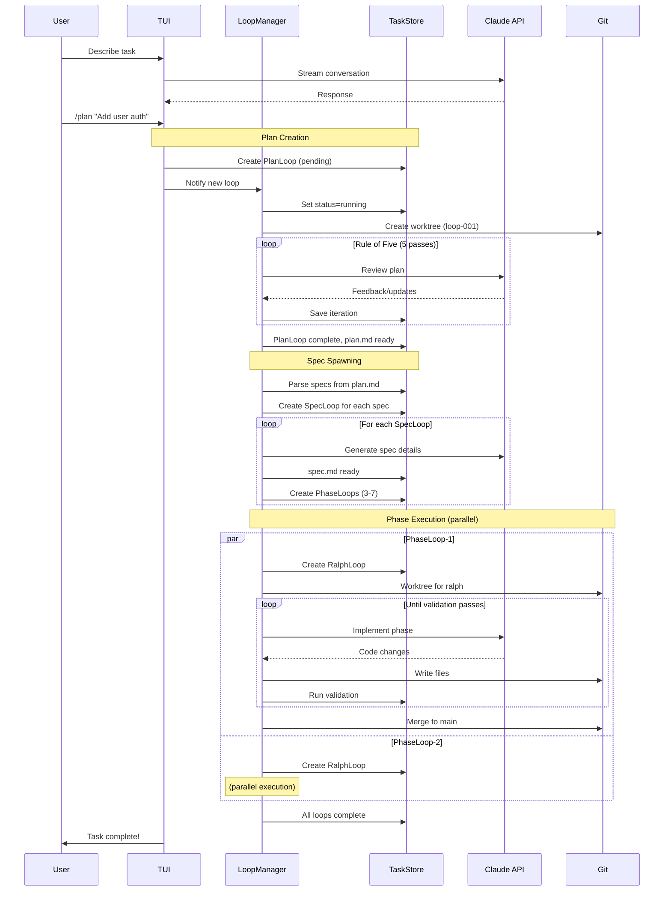
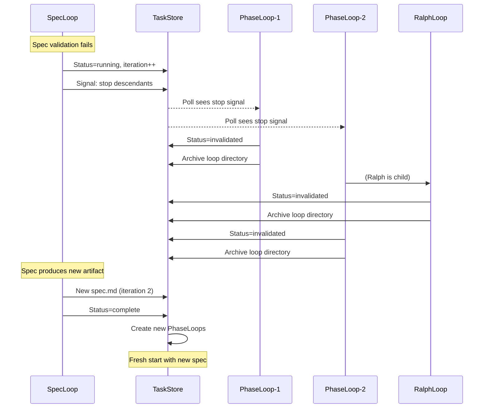
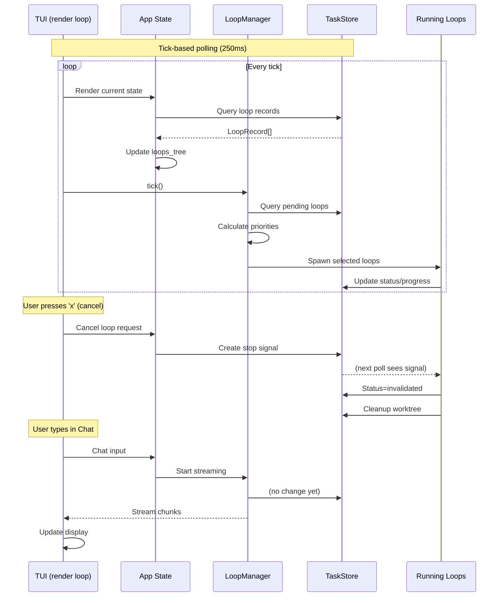

# Loopr: Design Documentation

**Version:** 1.0
**Date:** 2026-01-25
**Status:** Implementation Spec

---

## What is Loopr?

Loopr is an autonomous coding agent that executes complex software engineering tasks through a hierarchical loop system. Users describe what they want in natural language, and Loopr:

1. Creates a **Plan** (high-level approach, reviewed via Rule of Five)
2. Decomposes into **Specs** (detailed requirements)
3. Breaks specs into **Phases** (incremental implementation steps)
4. Executes phases via **Ralph loops** (the actual coding work)

Each level validates its output before spawning children, creating a self-correcting system that can handle multi-hour tasks autonomously.

---

## Getting Started

### Prerequisites

```bash
# Rust toolchain
curl --proto '=https' --tlsv1.2 -sSf https://sh.rustup.rs | sh

# Required environment variable
export ANTHROPIC_API_KEY="your-api-key"
```

### Installation

```bash
# Clone and build
git clone https://github.com/scottidler/loopr
cd loopr
cargo build --release

# Add to PATH
export PATH="$PATH:$(pwd)/target/release"
```

### Quick Start

```bash
# Start Loopr (launches TUI)
loopr

# Or start with a specific project
loopr --project ~/myproject
```

### Basic Workflow

1. **Chat View** - Describe your task:
   ```
   > Build a REST API for user management with JWT authentication
   ```

2. **Create Plan** - Use the /plan command:
   ```
   > /plan Add user authentication to the API
   ```

3. **Switch to Loops View** - Press `Tab` to see the loop hierarchy:
   ```
   ▼ ● Plan: Add user authentication [1/5]
     └── ○ Spec: Core auth (pending)
   ```

4. **Monitor Progress** - Watch loops execute:
   ```
   ▼ ● Plan: Add user authentication [5/5] ✓
     ├── ● Spec: Core auth [2/3]
     │   ├── ● Phase: User model (iter 3)
     │   └── ○ Phase: JWT tokens
     └── ○ Spec: Protected routes
   ```

5. **Review Results** - Code is committed to git as phases complete.

### Key Commands

| View | Key | Action |
|------|-----|--------|
| Both | `Tab` | Switch Chat/Loops view |
| Both | `?` | Show help |
| Both | `q` | Quit |
| Chat | `Enter` | Send message |
| Chat | `/plan <desc>` | Create a plan |
| Loops | `j/k` | Navigate |
| Loops | `s` | Start/pause loop |
| Loops | `x` | Cancel loop |
| Loops | `o` | View output |

### Configuration

Create `~/.config/loopr/loopr.yml`:

```yaml
llm:
  default: anthropic/claude-opus-4-5-20250514
  timeout-ms: 300000

concurrency:
  max-loops: 50
  max-api-calls: 10

validation:
  command: "otto ci"  # or "cargo test", "npm test", etc.
```

---

## Architecture Overview

```
┌─────────────────────────────────────────────────────────────────┐
│                        loopr (binary)                            │
├─────────────────────────────────────────────────────────────────┤
│  ┌─────────────┐  ┌─────────────┐  ┌─────────────────────────┐  │
│  │    TUI      │  │ LoopManager │  │       TaskStore         │  │
│  │  (ratatui)  │  │  (tokio)    │  │  (JSONL + SQLite)       │  │
│  │             │  │             │  │                         │  │
│  │ Chat View   │◄─┤ Scheduler   │◄─┤ LoopRecord              │  │
│  │ Loops View  │  │ Loop Runner │  │ Artifacts               │  │
│  └─────────────┘  └──────┬──────┘  └─────────────────────────┘  │
│                          │                                       │
│                   ┌──────▼──────┐                                │
│                   │  LlmClient  │                                │
│                   │ (Anthropic) │                                │
│                   └─────────────┘                                │
└─────────────────────────────────────────────────────────────────┘
```

**Key Design Decisions:**
- **No daemon** - Single process, `loopr` runs TUI directly
- **Tokio async** - LLM streaming, concurrent loop execution
- **Polling over IPC** - Components read TaskStore, no message passing
- **Git worktrees** - Each loop gets isolated workspace
- **Artifacts as glue** - plan.md/spec.md/phase.md connect loop levels

---

## Sequence Diagrams

### Complete Lifecycle: User Request to Merged Code



### Invalidation Cascade: Parent Re-iteration



### TUI-LoopManager-TaskStore Interaction



---

## Documentation Index

### Core Architecture

| Document | Status | Description |
|----------|--------|-------------|
| [loop-architecture.md](loop-architecture.md) | ✅ Approved | Loop hierarchy, storage layout, invalidation |
| [loop-coordination.md](loop-coordination.md) | ✅ Ready | Polling-based coordination, signal records |
| [execution-model.md](execution-model.md) | ✅ Impl Spec | Worktree lifecycle, crash recovery |
| [scheduler.md](scheduler.md) | ✅ Impl Spec | Priority model, dependency resolution |

### Data & Storage

| Document | Status | Description |
|----------|--------|-------------|
| [domain-types.md](domain-types.md) | ✅ Impl Spec | LoopRecord schema, Rust structs |
| [artifacts.md](artifacts.md) | ✅ Impl Spec | plan.md/spec.md/phase.md formats |
| [loop-config.md](loop-config.md) | ✅ Ready | 3-layer config hierarchy |

### LLM Integration

| Document | Status | Description |
|----------|--------|-------------|
| [llm-client.md](llm-client.md) | ✅ Impl Spec | Anthropic client, streaming, tokens |
| [tools.md](tools.md) | ✅ Impl Spec | 8 tools with Rust implementations |
| [progress-strategy.md](progress-strategy.md) | ✅ Ready | Cross-iteration state tracking |

### Validation & Quality

| Document | Status | Description |
|----------|--------|-------------|
| [loop-validation.md](loop-validation.md) | ✅ Ready | 3 backpressure layers |
| [rule-of-five.md](rule-of-five.md) | ✅ Active | Plan review methodology |

### User Interface

| Document | Status | Description |
|----------|--------|-------------|
| [tui.md](tui.md) | ✅ Impl Spec | Chat + Loops views, ratatui |

---

## Implementation Phases

The rewrite should proceed in phases, with each phase producing a working (if limited) system.

### Phase 1: Foundation (Core Data Layer)

**Goal:** Persistence and domain types that everything else builds on.

**Deliverables:**
- [ ] `TaskStore` - JSONL append + SQLite index
- [ ] `LoopRecord` struct and CRUD operations
- [ ] Storage layout (`~/.loopr/<project>/`)
- [ ] Project hash computation from git repo

**Dependencies:** None (foundation layer)

**Docs:** [domain-types.md](domain-types.md), [loop-architecture.md](loop-architecture.md) §Storage

**Validation:** Unit tests for TaskStore operations

---

### Phase 2: LLM Client

**Goal:** Streaming Anthropic client with tool support.

**Deliverables:**
- [ ] `LlmClient` trait
- [ ] `AnthropicClient` implementation
- [ ] Streaming response handling
- [ ] Token counting and cost tracking
- [ ] Basic tools: `read_file`, `write_file`, `bash`

**Dependencies:** Phase 1 (for config storage)

**Docs:** [llm-client.md](llm-client.md), [tools.md](tools.md)

**Validation:** Integration test calling Claude API

---

### Phase 3: Single Loop Execution

**Goal:** Run one Ralph loop end-to-end.

**Deliverables:**
- [ ] `RalphLoop` struct
- [ ] Iteration logic (prompt → LLM → tools → validate)
- [ ] Git worktree creation/cleanup
- [ ] Basic validation (run command, check exit code)
- [ ] Progress tracking (iteration count, status)

**Dependencies:** Phase 1, Phase 2

**Docs:** [execution-model.md](execution-model.md), [loop-validation.md](loop-validation.md)

**Validation:** Run a simple coding task (e.g., "add a function to sum two numbers")

---

### Phase 4: TUI (Minimal)

**Goal:** Visual interface to start and monitor loops.

**Deliverables:**
- [ ] Terminal setup (raw mode, alternate screen)
- [ ] Chat view with input/output
- [ ] Loops view (flat list, not tree yet)
- [ ] Basic keyboard navigation
- [ ] `/plan` command (just creates a draft, doesn't execute Rule of Five yet)

**Dependencies:** Phase 1, Phase 3

**Docs:** [tui.md](tui.md)

**Validation:** Can type a message, see response, view loop status

---

### Phase 5: Loop Hierarchy

**Goal:** Full Plan → Spec → Phase → Ralph chain.

**Deliverables:**
- [ ] `PlanLoop`, `SpecLoop`, `PhaseLoop` structs
- [ ] Artifact parsing (extract specs from plan.md, etc.)
- [ ] Child loop spawning from artifacts
- [ ] Parent-child relationships in TaskStore
- [ ] Tree view in TUI

**Dependencies:** Phase 3, Phase 4

**Docs:** [loop-architecture.md](loop-architecture.md), [artifacts.md](artifacts.md)

**Validation:** Create a plan, watch it spawn specs, phases, ralphs

---

### Phase 6: Scheduler

**Goal:** Intelligent loop prioritization and concurrency.

**Deliverables:**
- [ ] Priority calculation (type, age, depth, retry)
- [ ] Dependency resolution (parent must complete)
- [ ] Concurrency limits (global, per-type)
- [ ] LoopManager polling loop

**Dependencies:** Phase 5

**Docs:** [scheduler.md](scheduler.md)

**Validation:** Multiple pending loops run in correct order

---

### Phase 7: Rule of Five

**Goal:** Quality plan creation through 5-pass review.

**Deliverables:**
- [ ] 5 review passes with specific prompts
- [ ] Plan revision between passes
- [ ] Validation at each pass
- [ ] Integration with `/plan` command

**Dependencies:** Phase 2, Phase 5

**Docs:** [rule-of-five.md](rule-of-five.md)

**Validation:** `/plan` produces high-quality, validated plans

---

### Phase 8: Advanced Validation

**Goal:** Full 3-layer backpressure system.

**Deliverables:**
- [ ] Layer 1: Format/syntax checks
- [ ] Layer 2: Test execution
- [ ] Layer 3: LLM-as-judge
- [ ] Feedback incorporation into prompts
- [ ] Invalidation cascade on parent re-iteration

**Dependencies:** Phase 5, Phase 6

**Docs:** [loop-validation.md](loop-validation.md), [loop-architecture.md](loop-architecture.md) §Onion

**Validation:** Failing validation causes re-iteration with feedback

---

### Phase 9: Configuration

**Goal:** User-configurable behavior.

**Deliverables:**
- [ ] Global config (`~/.config/loopr/config.yml`)
- [ ] Project config (`.loopr.yml`)
- [ ] Loop-type config
- [ ] Config resolution (3-layer merge)

**Dependencies:** Phase 1

**Docs:** [loop-config.md](loop-config.md)

**Validation:** Config changes affect loop behavior

---

### Phase 10: Polish & Hardening

**Goal:** Production-ready robustness.

**Deliverables:**
- [ ] Crash recovery (resume interrupted loops)
- [ ] Disk space management (worktree cleanup)
- [ ] Error handling and user-friendly messages
- [ ] Logging and observability
- [ ] Documentation and help text

**Dependencies:** All previous phases

**Docs:** [execution-model.md](execution-model.md) §Crash Recovery

**Validation:** Survives kill -9, disk full, API errors

---

## Dependency Graph

```
Phase 1: Foundation
    │
    ├──► Phase 2: LLM Client
    │        │
    │        └──► Phase 3: Single Loop ◄──┐
    │                 │                    │
    │                 ▼                    │
    │            Phase 4: TUI (Minimal)    │
    │                 │                    │
    │                 ▼                    │
    │            Phase 5: Loop Hierarchy ──┘
    │                 │
    │                 ├──► Phase 6: Scheduler
    │                 │
    │                 └──► Phase 7: Rule of Five
    │                          │
    │                          ▼
    │                     Phase 8: Advanced Validation
    │
    └──► Phase 9: Configuration
              │
              ▼
         Phase 10: Polish
```

---

## File Structure (Target)

```
loopr/
├── Cargo.toml
├── src/
│   ├── main.rs              # Entry point, arg parsing
│   ├── lib.rs               # Public API
│   │
│   ├── store/               # Phase 1
│   │   ├── mod.rs
│   │   ├── task_store.rs    # JSONL + SQLite
│   │   └── records.rs       # LoopRecord, etc.
│   │
│   ├── llm/                 # Phase 2
│   │   ├── mod.rs
│   │   ├── client.rs        # LlmClient trait
│   │   ├── anthropic.rs     # AnthropicClient
│   │   └── tools/           # Tool implementations
│   │       ├── mod.rs
│   │       ├── read_file.rs
│   │       ├── write_file.rs
│   │       └── bash.rs
│   │
│   ├── loops/               # Phase 3, 5
│   │   ├── mod.rs
│   │   ├── ralph.rs         # RalphLoop
│   │   ├── phase.rs         # PhaseLoop
│   │   ├── spec.rs          # SpecLoop
│   │   ├── plan.rs          # PlanLoop
│   │   └── manager.rs       # LoopManager
│   │
│   ├── scheduler/           # Phase 6
│   │   ├── mod.rs
│   │   └── priority.rs
│   │
│   ├── validation/          # Phase 8
│   │   ├── mod.rs
│   │   ├── format.rs
│   │   ├── test_runner.rs
│   │   └── llm_judge.rs
│   │
│   ├── tui/                 # Phase 4
│   │   ├── mod.rs
│   │   ├── app.rs
│   │   ├── state.rs
│   │   ├── views.rs
│   │   ├── tree.rs
│   │   ├── runner.rs
│   │   └── events.rs
│   │
│   └── config/              # Phase 9
│       ├── mod.rs
│       └── schema.rs
│
└── tests/
    ├── store_tests.rs
    ├── llm_tests.rs
    ├── loop_tests.rs
    └── integration/
        └── full_plan_test.rs
```

---

## Getting Started (For Implementers)

1. **Read the core docs first:**
   - [loop-architecture.md](loop-architecture.md) - The "why"
   - [domain-types.md](domain-types.md) - The data model
   - [execution-model.md](execution-model.md) - How loops run

2. **Start with Phase 1** - Get TaskStore working with tests

3. **Each phase should:**
   - Have passing tests before moving on
   - Produce a working (if limited) system
   - Not break previous functionality

4. **When in doubt:**
   - Check the relevant doc's "Implementation" section
   - Look at code examples in the docs (they're meant to be copy-paste ready)
   - The Rust code in docs is the source of truth for types/signatures

---

## Glossary

| Term | Definition |
|------|------------|
| **Loop** | A single execution unit (Plan, Spec, Phase, or Ralph) |
| **Iteration** | One attempt within a loop (prompt → LLM → validate) |
| **Artifact** | Output file (plan.md, spec.md, phase.md) that spawns children |
| **TaskStore** | Persistence layer (JSONL + SQLite) - see [taskstore](https://github.com/scottidler/taskstore) |
| **Ralph** | Leaf-level loop that does actual coding work |
| **Rule of Five** | 5-pass review process for plan quality |
| **Worktree** | Git worktree for isolated loop execution |
| **Backpressure** | Validation layers that cause re-iteration on failure |

---

## References

- [Anthropic API Docs](https://docs.anthropic.com/)
- [ratatui](https://ratatui.rs/) - TUI framework
- [k9s](https://k9scli.io/) - UI inspiration
- [git-worktree](https://git-scm.com/docs/git-worktree) - Isolated workspaces
