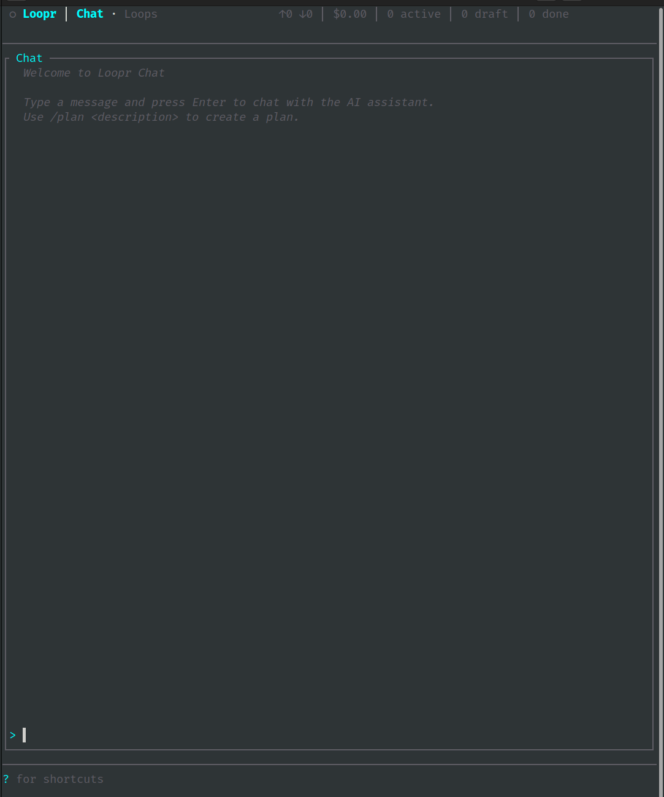
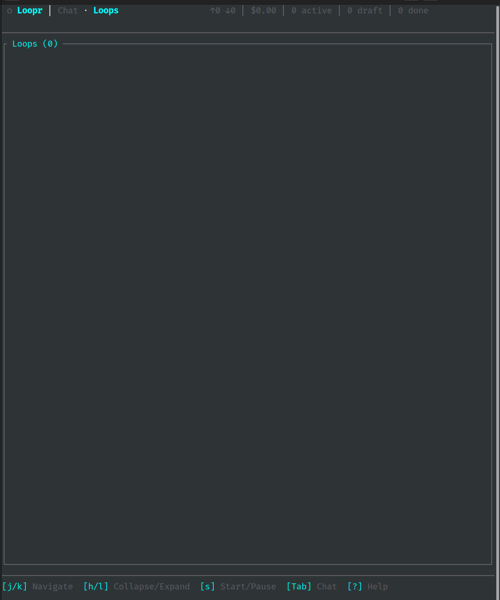

# TUI Design

**Author:** Scott A. Idler
**Date:** 2026-01-30
**Status:** Implementation Spec
**Based on:** loopr/docs/tui.md (adapted for daemon connection)

---

## Summary

Loopr provides a k9s-style terminal interface with two views: **Chat** and **Loops**. In v2, the TUI is a **thin client** that connects to the daemon via Unix socket. All state comes from the daemon; the TUI just renders and handles input.

---

## Architecture

```
TUI (ratatui)
├── DaemonConnection        # Unix socket to daemon
│   ├── send_request()      # Send commands
│   └── event_stream        # Receive push events
├── App                     # Keyboard handling
├── State                   # Display state (from daemon)
└── Views                   # Render functions
```

**Key change from v1:** TUI does NOT read TaskStore directly. All state comes via daemon IPC.

---

## Two Views

### Chat View

Primary interaction. Users describe tasks, LLM responds, tools execute.

```
┌─────────────────────────────────────────────────────────────────────┐
│ ● Loopr │ Chat · Loops                        ↑1.2K ↓0.3K │ $0.15  │
├─────────────────────────────────────────────────────────────────────┤
│ ─ Chat ─────────────────────────────────────────────────────────────│
│ Welcome to Loopr Chat                                               │
│                                                                     │
│ > Build a REST API for user management                              │
│                                                                     │
│   I'll help you build a REST API. Let me create a plan...           │
│                                                                     │
│ ● read_file(src/main.rs)                                            │
│ └ Found 45 lines                                                    │
│                                                                     │
│ > _                                                                 │
├─────────────────────────────────────────────────────────────────────┤
│ [Enter] Send /clear Clear                   [Tab] Views [?] Help [q]│
└─────────────────────────────────────────────────────────────────────┘
```

**Example: Chat View**



**Chat vs Loops:**

| Feature | Chat | Loops |
|---------|------|-------|
| Purpose | Quick questions, exploration | Persistent autonomous work |
| Persistence | Session-only (cleared on TUI restart) | Persisted in TaskStore |
| Creates work | No (unless `/plan` used) | Yes (iterates until validation) |
| Context | Accumulated in conversation | Fresh context per iteration |

**Key distinction:** Chat is for conversation. Use `/plan <task>` to create persistent work that survives restarts and executes autonomously.

### Loops View

Hierarchical tree of all loops.

```
┌─────────────────────────────────────────────────────────────────────┐
│ ● Loopr │ Chat · Loops                   2 active │ 1 draft │ 3 done│
├─────────────────────────────────────────────────────────────────────┤
│ ─ Loops (6) ────────────────────────────────────────────────────────│
│ ▼ ● Plan: Build REST API [1/5]              → plan.md ✓             │
│   ├─▼ ● Spec: User endpoints [2/3]          → spec.md ✓             │
│   │   ├── ● Phase: Create models (iter 3/10)                        │
│   │   ├── ○ Phase: Add validation                                   │
│   │   └── ○ Phase: Write tests                                      │
│   └── ○ Spec: Auth endpoints                                        │
│ ◌ Plan: Add logging [draft]                                         │
├─────────────────────────────────────────────────────────────────────┤
│ [Enter] Describe [s] State [o] Output [L] Logs [x] Cancel   [Tab] [?]│
└─────────────────────────────────────────────────────────────────────┘
```

**Example: Loops View**



---

## State Management

```rust
pub struct TuiState {
    // Connection
    pub connected: bool,
    pub reconnecting: bool,

    // View
    pub current_view: View,
    pub help_visible: bool,
    pub filter_input: Option<String>,  // Active filter (Loops view)

    // Chat (always input-ready, no mode switching)
    pub chat_history: Vec<ChatMessage>,
    pub chat_input: String,
    pub chat_cursor_pos: usize,  // Byte offset for UTF-8
    pub chat_streaming: bool,
    pub chat_scroll: Option<usize>,  // None = auto-scroll

    // Loops
    pub loops_tree: LoopTree,

    // Metrics (from daemon)
    pub loops_active: usize,
    pub loops_draft: usize,
    pub loops_complete: usize,
    pub session_input_tokens: u64,
    pub session_output_tokens: u64,
    pub session_cost_usd: f64,
}

pub enum View {
    Chat,
    Loops,
}

// Quit safety - double-tap required
pub struct QuitDetector {
    last_ctrl_c: Option<Instant>,
    last_ctrl_d: Option<Instant>,
    threshold: Duration,  // 500ms
}
```

---

## Daemon Connection

```rust
pub struct DaemonConnection {
    socket: UnixStream,
    event_rx: mpsc::Receiver<DaemonEvent>,
    request_id: AtomicU64,
}

impl DaemonConnection {
    pub async fn connect() -> Result<Self> {
        let socket_path = config::daemon_socket_path();

        // Try connect
        let socket = match UnixStream::connect(&socket_path).await {
            Ok(s) => s,
            Err(_) => {
                // Start daemon if not running
                start_daemon().await?;
                tokio::time::sleep(Duration::from_millis(500)).await;
                UnixStream::connect(&socket_path).await?
            }
        };

        // Initial handshake
        let (event_tx, event_rx) = mpsc::channel(100);
        let conn = Self {
            socket,
            event_rx,
            request_id: AtomicU64::new(1),
        };

        // Spawn event reader
        let socket_clone = conn.socket.clone();
        tokio::spawn(async move {
            Self::read_events(socket_clone, event_tx).await;
        });

        // Request initial state
        conn.request("connect", json!({ "version": env!("CARGO_PKG_VERSION") })).await?;

        Ok(conn)
    }

    pub async fn request(&self, method: &str, params: Value) -> Result<Value> {
        let id = self.request_id.fetch_add(1, Ordering::SeqCst);
        let request = json!({
            "id": id,
            "method": method,
            "params": params,
        });

        // Send
        let mut socket = self.socket.try_clone()?;
        socket.write_all(format!("{}\n", request).as_bytes()).await?;

        // Read response (TODO: proper request/response matching)
        let mut buf = String::new();
        socket.read_line(&mut buf).await?;
        let response: Value = serde_json::from_str(&buf)?;

        if let Some(error) = response.get("error") {
            return Err(eyre!("Daemon error: {}", error));
        }

        Ok(response["result"].clone())
    }

    async fn read_events(mut socket: UnixStream, tx: mpsc::Sender<DaemonEvent>) {
        let mut reader = BufReader::new(&mut socket);
        loop {
            let mut line = String::new();
            if reader.read_line(&mut line).await.is_err() {
                break;
            }
            if let Ok(event) = serde_json::from_str::<DaemonEvent>(&line) {
                let _ = tx.send(event).await;
            }
        }
    }
}
```

---

## Main Loop

```rust
pub struct TuiRunner {
    terminal: Tui,
    app: App,
    daemon: DaemonConnection,
    state: TuiState,
}

impl TuiRunner {
    pub async fn run(&mut self) -> Result<()> {
        loop {
            // 1. Render
            self.terminal.draw(|f| views::render(&self.state, f))?;

            // 2. Handle events
            tokio::select! {
                // Keyboard input
                key = self.app.next_key() => {
                    if let Some(key) = key {
                        if self.handle_key(key).await? {
                            break; // Quit
                        }
                    }
                }

                // Daemon events
                event = self.daemon.event_rx.recv() => {
                    if let Some(event) = event {
                        self.handle_daemon_event(event).await?;
                    }
                }

                // Tick (for animations, reconnect check)
                _ = tokio::time::sleep(Duration::from_millis(250)) => {
                    self.tick().await?;
                }
            }
        }

        Ok(())
    }

    async fn handle_daemon_event(&mut self, event: DaemonEvent) -> Result<()> {
        match event.event.as_str() {
            "chat.chunk" => {
                let text = event.data["text"].as_str().unwrap_or("");
                let done = event.data["done"].as_bool().unwrap_or(false);
                self.state.append_chat_chunk(text, done);
            }
            "chat.tool_call" => {
                let tool = event.data["tool"].as_str().unwrap_or("");
                self.state.add_tool_call(tool, "executing...");
            }
            "chat.tool_result" => {
                let tool = event.data["tool"].as_str().unwrap_or("");
                let output = event.data["output"].as_str().unwrap_or("");
                self.state.update_tool_result(tool, output);
            }
            "loop.updated" => {
                let record: Loop = serde_json::from_value(event.data)?;
                self.state.loops_tree.update(record);
            }
            "metrics.update" => {
                self.state.update_metrics(&event.data);
            }
            _ => {}
        }
        Ok(())
    }
}
```

---

## Keyboard Handling (Claude Code Style)

**Design principle:** No vim-style modes. Chat view is always ready for input. Quit requires double-tap for safety.

### Global Keys

| Key | Action |
|-----|--------|
| `Ctrl+C` (x2) | Quit (double-tap within 500ms) |
| `Ctrl+D` (x2) | Quit (double-tap within 500ms) |
| `Tab` | Cycle views |
| `F1` | Toggle help |

### Chat View (Always Input Mode)

| Key | Action |
|-----|--------|
| `[any char]` | Insert at cursor |
| `Enter` | Send message |
| `Esc` | Clear input |
| `←/→` | Move cursor |
| `Home/End` | Start/end of line |
| `Alt+↑` / `PgUp` | Scroll history up |
| `Alt+↓` / `PgDn` | Scroll history down |
| `/clear` | Clear conversation |
| `/plan <desc>` | Create plan |
| `/help` | Show help |

### Loops View (Navigation Mode)

| Key | Action |
|-----|--------|
| `j/k` or `↑/↓` | Navigate |
| `h/l` or `←/→` | Collapse/expand |
| `Enter` | View details |
| `s` | Toggle state |
| `o` | View output |
| `x` | Cancel loop |
| `/` | Filter loops |

---

## Commands

```rust
async fn handle_chat_submit(&mut self) -> Result<()> {
    let input = std::mem::take(&mut self.state.chat_input);

    if input.starts_with("/") {
        self.handle_command(&input).await
    } else {
        self.send_chat(&input).await
    }
}

async fn handle_command(&mut self, input: &str) -> Result<()> {
    let parts: Vec<_> = input.splitn(2, ' ').collect();
    let cmd = parts[0];
    let args = parts.get(1).map(|s| s.trim());

    match cmd {
        "/clear" => {
            self.daemon.request("chat.clear", json!({})).await?;
            self.state.chat_history.clear();
        }
        "/plan" => {
            if let Some(desc) = args {
                self.daemon.request("loop.create_plan", json!({
                    "description": desc
                })).await?;
                self.state.add_system_message(&format!("Creating plan: {}", desc));
            } else {
                self.state.add_error_message("Usage: /plan <description>");
            }
        }
        _ => {
            self.state.add_error_message(&format!("Unknown command: {}", cmd));
        }
    }

    Ok(())
}

async fn send_chat(&mut self, message: &str) -> Result<()> {
    // Add to history
    self.state.chat_history.push(ChatMessage::user(message));

    // Send to daemon
    self.daemon.request("chat.send", json!({
        "message": message
    })).await?;

    // Enable streaming mode
    self.state.chat_streaming = true;

    Ok(())
}
```

---

## Loop Actions

```rust
async fn handle_loop_action(&mut self, action: LoopAction) -> Result<()> {
    let loop_id = self.state.loops_tree.selected_id()
        .ok_or_else(|| eyre!("No loop selected"))?;

    match action {
        LoopAction::Start => {
            self.daemon.request("loop.start", json!({ "id": loop_id })).await?;
        }
        LoopAction::Pause => {
            self.daemon.request("loop.pause", json!({ "id": loop_id })).await?;
        }
        LoopAction::Resume => {
            self.daemon.request("loop.resume", json!({ "id": loop_id })).await?;
        }
        LoopAction::Cancel => {
            self.daemon.request("loop.cancel", json!({ "id": loop_id })).await?;
        }
        LoopAction::Delete => {
            self.daemon.request("loop.delete", json!({ "id": loop_id })).await?;
        }
    }

    Ok(())
}
```

---

## Reconnection

```rust
async fn tick(&mut self) -> Result<()> {
    if !self.state.connected {
        self.state.reconnecting = true;

        match DaemonConnection::connect().await {
            Ok(conn) => {
                self.daemon = conn;
                self.state.connected = true;
                self.state.reconnecting = false;

                // Refresh state
                let loops = self.daemon.request("loop.list", json!({})).await?;
                self.state.loops_tree.rebuild(&loops["loops"]);
            }
            Err(_) => {
                // Will retry on next tick
            }
        }
    }

    Ok(())
}
```

---

## File Structure

```
loopr/src/tui/
├── mod.rs              # Public exports
├── app.rs              # Keyboard handling
├── state.rs            # TuiState
├── views.rs            # Render functions
├── tree.rs             # LoopTree
├── runner.rs           # Main loop
├── daemon.rs           # DaemonConnection
└── events.rs           # Event handling
```

---

## Configuration

```yaml
# loopr.yml
tui:
  tick_rate_ms: 250
  scroll_page_size: 10
  colors:
    running: "#00FF7F"
    pending: "#FFD700"
    complete: "#32CD32"
    failed: "#DC143C"
```

---

## References

- [architecture.md](architecture.md) - System overview
- [ipc-protocol.md](ipc-protocol.md) - Daemon protocol
- [loop-architecture.md](loop-architecture.md) - Loop hierarchy
